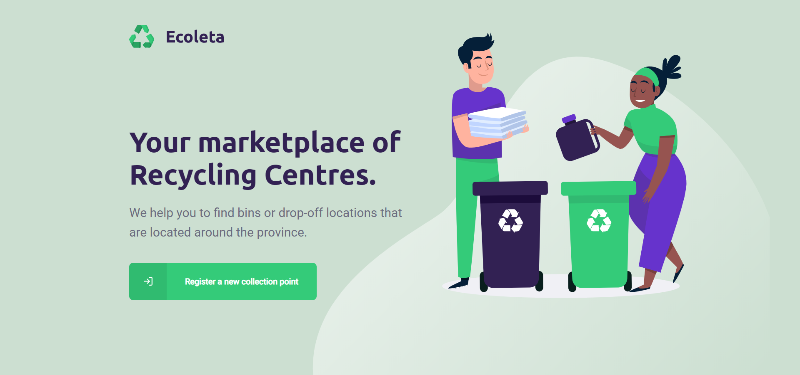
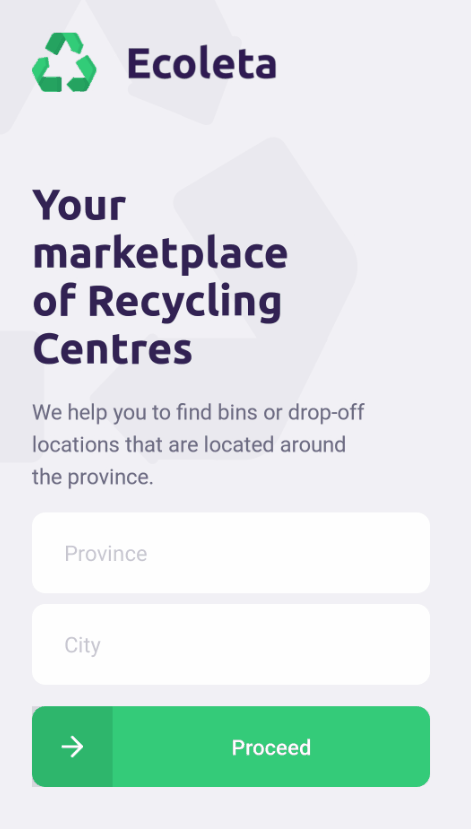

## ✔ About
This project was built as part of my studies. It's a fullstack application consisted of a backend api, front-end page and mobile app.

I used [<b>`TypeScript`</b>](https://www.typescriptlang.org/) for the entire project development and you can see de details bellow. 

### 🖥 API
---
Built with [<b>`Node.js`</b>](https://nodejs.org/en/) and  <b>`Express`</b> :
Express is a minimal and flexible web application framework that offers a set of features for web, mobile and api development.

Database: <b>`SQLite`</b> : small and self contained SQL database engine that fits for this example.

<b>`Knex.js`</b>: SQL query builder
```javascript
const items = await knex('items')
    .join('point_items','items.id', '=', 'point_items.item_id')
    .where('point_items.point_id', id)
    .select('items.title');
```

<b>`Multer`</b> for handling multipart/form-data

---

### 💻 Web
---
Built in <b>`React.js`</b>, I used `Axios` to read data from my API, a promise-based HTTP client for the browser and node.js

Map: <b>`Leaflet`</b> a open-source JavaScript library for mobile-friendly interactive maps

<h4>
    
</h4>

---

## 📱 Mobile
---
Built in [<b>`React Native`</b>](https://facebook.github.io/react-native/), it uses <b>`Axios`</b> to read data from my API.
I also used [<b>`Expo`</b>](https://expo.io/) for development:  an open-source platform for making universal native apps for Android, iOS, and the web with JavaScript and React.
Expo has some really nice features that facilitated this project such as: 
```expo-location``` to ask permission to get the current location of user  and ```expo-mail-composer``` that can be used with your native email app.


<h4>
    
</h4>
